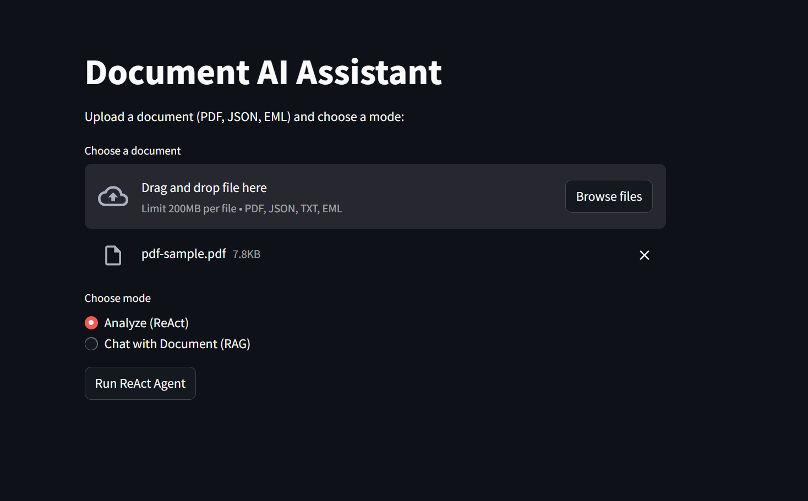

# 🧠 AI Document Assistant

**Multimodal Document Intelligence with Streamlit, LangChain, Ollama, and RAG**

The **AI Document Assistant** is a smart, modular document understanding system that processes PDFs, JSON files, and emails using Large Language Models (LLMs). It integrates **ReAct-style agents**, **local LLMs via Ollama**, **RAG pipelines**, **caching with TTL**, and a user-friendly **Streamlit interface** — all optimized for performance and extensibility.

---

## 🚀 Key Features

- 🔍 **ReAct Agent Routing:** Dynamically routes documents to the best-suited tool using reasoning steps.
- 📧 **Email Agent:** Extracts structured data (Sender, Intent, Urgency) from `.eml` files.
- 📄 **PDF Agent:** Summarizes documents and highlights key points from PDF chunks.
- 📦 **JSON Agent:** Validates structure, parses fields, and flags anomalies in JSON.
- 🧠 **RAG-Enabled Chat:** Supports Retrieval-Augmented Generation using FAISS-based vector search on document chunks.
- ⚡ **LRU + TTL Caching:** Avoids redundant LLM calls with an in-memory cache that uses Least Recently Used logic and Time-To-Live expiry.
- 💬 **Chat Memory:** Persists user queries and responses across sessions for contextual continuity.
- 🖼️ **Streamlit UI:** Upload and interact with documents in a polished web interface.
- 🧩 **Plug-and-Play Tools:** Add new document types or processing modules easily.

---
## 📽️ Demo

### 🔍 RAG Chat Interface


### 📝 Summarization Flow

---

## 🛠️ Installation

### 1. Clone the Repository

```bash
git clone https://github.com/SurriyaGokul/GenAI.git
cd GenAI
````

### 2. Install Python Dependencies

```bash
pip install -r requirements.txt
```

### 3. Install and Setup Ollama

Download and install [Ollama](https://ollama.com/), then pull the required models:

```bash
ollama pull llama3
ollama pull nomic-embed-text
```

---

## 💡 How to Use

### 🔘 Launch the Web Interface

```bash
streamlit run main.py
```

Upload your `.pdf`, `.json`, `.txt`, or `.eml` file to start analysis.

---

### 🧠 Using Agents Programmatically

```python
from agents.load_email import email_agent
from agents.load_pdf import pdf_agent
from agents.load_json import json_agent

print(email_agent("test.eml"))
print(pdf_agent("report.pdf"))
print(json_agent("data.json"))
```

---

## 🧠 Retrieval-Augmented Generation (RAG)

Upload a document, and the system builds a FAISS vector index from its contents. You can then ask natural language questions that retrieve relevant chunks + LLM reasoning.

* Powered by `RecursiveCharacterTextSplitter`, `OllamaEmbeddings`, and `FAISS`.
* Vectorstore is cached locally for performance.

---

## 🗂️ Project Structure

```
GenAI/
│
├── agents/
│   ├── load_email.py       # Email extraction agent
│   ├── load_pdf.py         # PDF summarization agent
│   ├── load_json.py        # JSON validation agent
│   └── rag_chat.py         # RAG builder and Q&A logic
│
├── memory/
│   └── memory_store.py     # LRUCacheTTL implementation
│
├── test_files/             # Sample documents
├── main.py                 # Streamlit app entry point
├── requirements.txt
└── README.md
```

---

## 🧩 Add a New Agent

1. **Create an agent** in `agents/load_yourtype.py`
2. Implement:

   * Document parsing
   * Prompt generation
   * LLM inference
   * JSON output
3. Register the agent in `main.py`’s tool list.

---

## 🧠 Behind the Scenes

| Component       | Role                                                            |
| --------------- | --------------------------------------------------------------- |
| **LangChain**   | LLM abstraction, prompt chaining, ReAct agent architecture      |
| **Ollama**      | Local model runner (e.g., Llama3, Gemma, Nomic Embeddings)      |
| **Streamlit**   | Web interface for upload, interaction, and visualization        |
| **RAG (FAISS)** | Retrieves relevant chunks for questions using dense embeddings  |
| **LRUCacheTTL** | Saves compute by avoiding duplicate LLM calls with TTL eviction |

---

## ✅ Requirements

* Python 3.8+
* Ollama (local LLMs)
* Streamlit, LangChain, FAISS, PyPDF, etc.

See `requirements.txt` for full list.

---

## 📄 License

Licensed under the **MIT License**. See [`LICENSE`](https://opensource.org/licenses/MIT) for details.

---

## 👤 Author

**Surriya Gokul**
GitHub: [@SurriyaGokul](https://github.com/SurriyaGokul)

> *Push the limits of document intelligence — locally, privately, and powerfully.*


